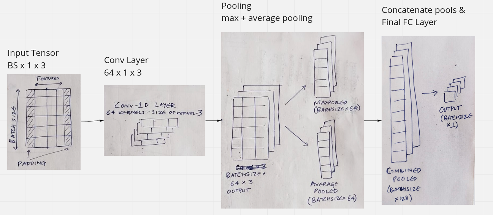

# Time Series Analysis with CNNs

This repo is to demonstrate the use of CNNs for time series forecasting. We first scrape data from [nsepy](https://nsepy.xyz/) for stock tickers eg. `Reliance Industries`.

Then we use convolutional networks to develop a DL model for time series forecasting for single/multistep time series. Here is a visual of how 1D convs work.

So, we define a network as follows and observe that the results are not so bad. Feel free to fork the repo and experiment with multi-variate time series problems as well along the same lines :)

